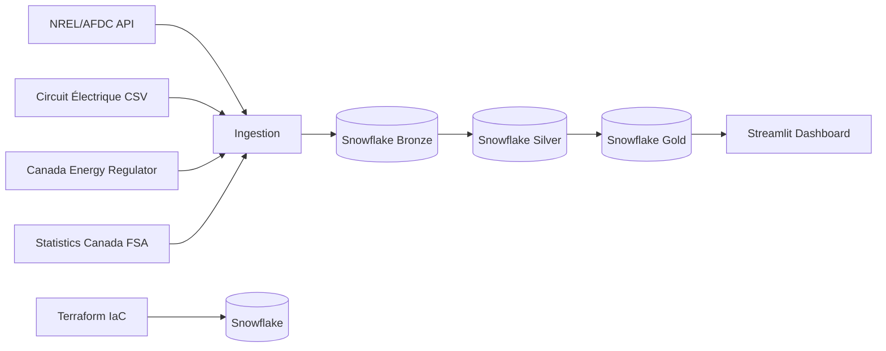

# ChargeIntel Canada

An open analytics platform exposing Canada-specific EV charging coverage gaps and pricing transparency. Built for EV network planners, CPOs, policy teams, and infrastructure investors.

[](LICENSE)

[](https://chargeintelcanada.streamlit.app/)

---

## What It Does

ChargeIntel Canada aggregates public EV charging data from NREL/AFDC, Circuit Électrique (Hydro-Québec), the Canada Energy Regulator, and Statistics Canada to answer three questions:

1. **Where are the coverage gaps?** – Province and FSA-level coverage scores, highway corridor gap analysis.
2. **How do networks compare on price?** – Normalized pricing across FLO, ChargePoint, Electrify Canada, Petro-Canada, and others.
3. **Where should new infrastructure go?** – Site viability scoring by FSA combining coverage gaps, population, and electricity cost.

---

## Architecture



| Layer | Tool | Purpose |
|---|---|---|
| Infrastructure | Terraform + Snowflake | Reproducible cloud warehouse |
| Ingestion | Python + requests | Pull data from APIs and CSVs |
| Transformation | dbt-core 1.8 | Medallion layers: Bronze → Silver → Gold |
| Dashboard | Streamlit | Public analytics interface |

---

## Local Setup

### Prerequisites

- Python 3.11+
- Terraform >= 1.7
- A Snowflake account (free trial works)
- NREL/AFDC API key (free at [developer.nlr.gov](https://developer.nlr.gov))

### Steps

```bash
# 1. Clone the repo
git clone https://github.com/bradleyohler/charge-intel-canada.git
cd charge-intel-canada

# 2. Generate a key pair for the Snowflake service account
openssl genrsa -out charge_intel_svc_key.p8 2048
openssl pkcs8 -topk8 -inform PEM -outform PEM -nocrypt \
  -in charge_intel_svc_key.p8 -out charge_intel_svc_key_pkcs8.p8
# Register the public key in Snowsight:
#   ALTER USER CHARGE_INTEL_SVC SET RSA_PUBLIC_KEY='<contents of .pub file>';

# 3. Configure environment
cp .env.example .env
# Edit .env – set AFDC_API_KEY, Snowflake connection vars,
# and SNOWFLAKE_PRIVATE_KEY_PATH to the absolute path of your .p8 key

# 4. Provision Snowflake infrastructure
cd terraform
cp terraform.tfvars.example terraform.tfvars
# Edit terraform.tfvars with your Snowflake org/account names and admin key path
terraform init
terraform apply
cd ..

# 5. Install Python dependencies
pip install -r requirements.txt -r requirements-dev.txt
pip install -e . --no-deps
# The editable install registers `dashboard` and `ingestion` as importable
# packages regardless of cwd – required because `streamlit run` only adds
# the script's own directory to sys.path, not the repo root.

# 6. Run ingestion
python -m ingestion.sources.afdc
python -m ingestion.sources.circuit_electrique
python -m ingestion.sources.statcan
python -m ingestion.sources.cer_rates

# 7. Run dbt transformations
cd dbt
cp profiles.yml.example profiles.yml
# profiles.yml reads the same env vars from .env – no edits needed
dbt deps
dbt run
dbt test
cd ..

# 8. Launch dashboard
streamlit run dashboard/app.py
```

---

## Tech Stack

| Component | Tool | Version |
|---|---|---|
| Data warehouse | Snowflake | cloud |
| Ingestion | Python + requests | 3.11+ |
| Transformation | dbt-core + dbt-snowflake | 1.8.x |
| Infrastructure | Terraform + Snowflake provider | >=1.7 / ~>0.90 |
| Dashboard | Streamlit | >=1.35 |
| Maps | pydeck | >=0.9 |
| Charts | Altair | >=5.3 |

---

## Live Dashboard

**[chargeintelcanada.streamlit.app](https://chargeintelcanada.streamlit.app/)**

## Release Status

| Release | Status | Description |
|---|---|---|
| 0 – Scaffold | Complete | Repo structure, Terraform, dbt scaffold, AFDC ingestion |
| 1 – Station Inventory | Complete | Full Canada station data, coverage map live |
| 2 – Coverage Gaps | Complete | FSA population data, electricity rates, corridor analysis, coverage choropleth |
| 3 – Pricing | **Current** | Network pricing scrapers, comparison dashboard |
| 4 – Integrated Platform | Planned | Site viability scoring, v1.0 release |

---

## License

MIT – see [LICENSE](LICENSE).
